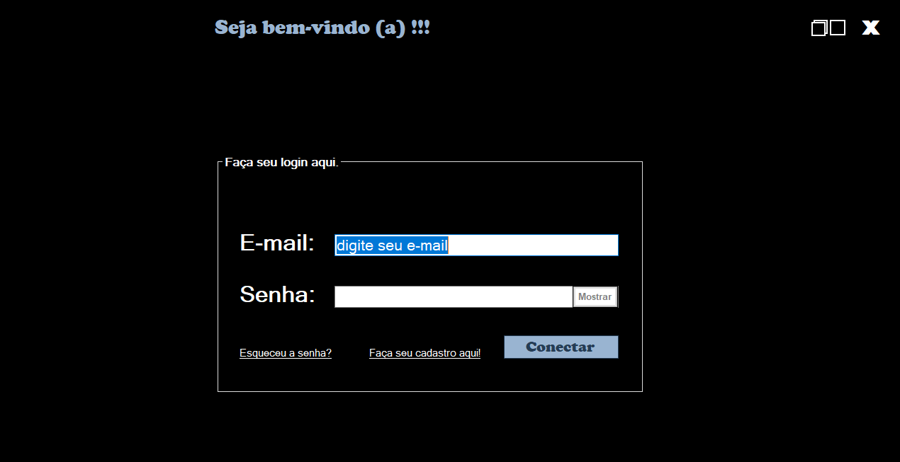
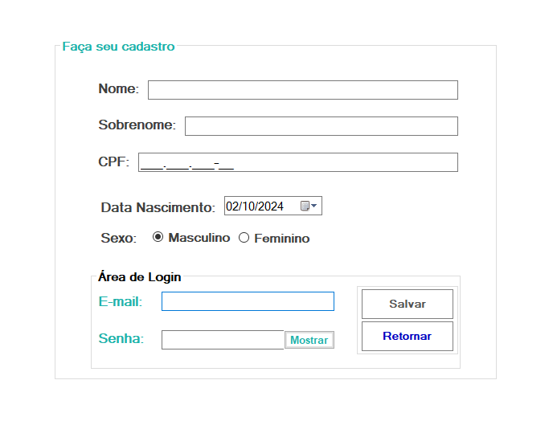
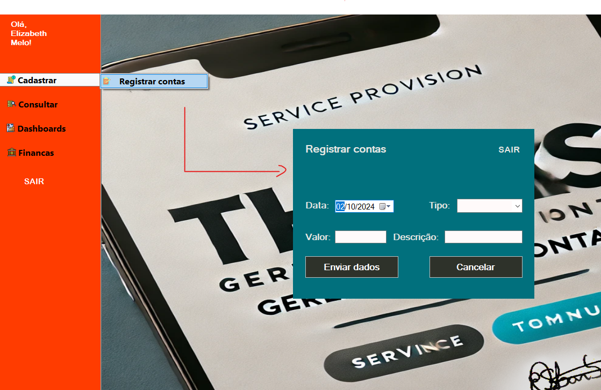
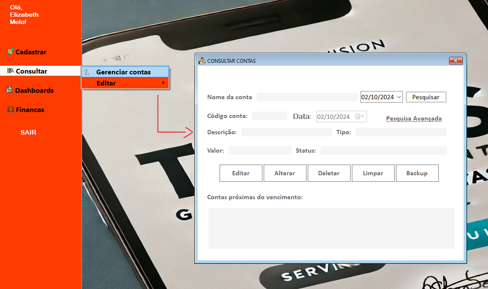
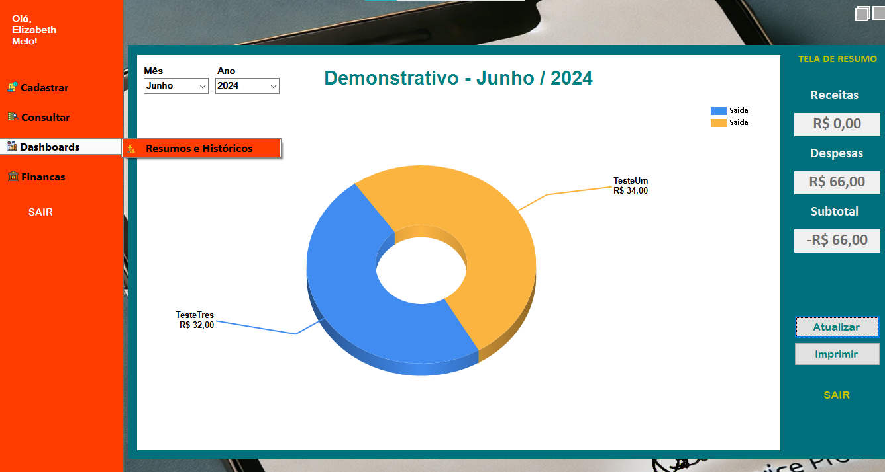
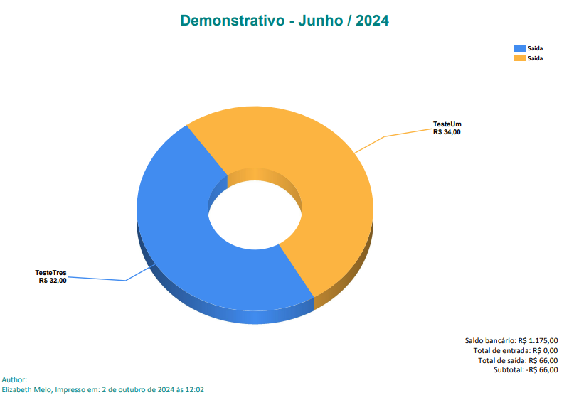
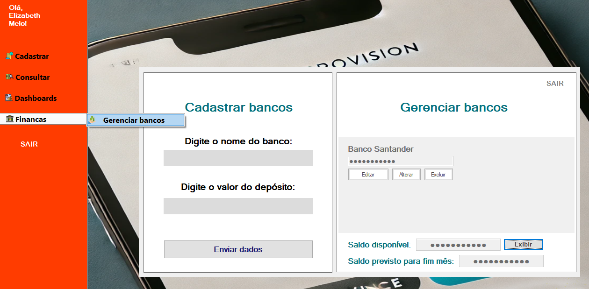

# <span style="color: aqua"> 💰 Gerenciador Financeiro </span>

## <span style="color: aqua"> 📋 Descrição </span>

O **Gerenciador Financeiro** é um sistema desenvolvido para ajudar pessoas a organizar suas finanças pessoais de forma eficiente e prática. O projeto teve início com uma base em planilhas inteligentes de Excel, mas com a necessidade de mais funcionalidades e robustez, evoluiu para um software completo.

Este sistema oferece funcionalidades como:

### <span style="color:orange">1️⃣ Sistema de login: </span>
Os usuários acessarão o sistema através da tela de login. Se for o primeiro acesso, será necessário realizar o cadastro. Para isso, basta clicar no link **Cadastre-se**. Caso já tenha um cadastro, mas não se lembre da sua senha, é possível recuperá-la. Para isso, clique no link **Esqueceu a senha?**  e siga as etapas para criar uma nova senha.




### <span style="color:orange">2️⃣ Cadastro de usuários personalizados: </span>
Os usuários podem se cadastrar acessando a tela de Cadastro de Usuário. Para completar o registro, é necessário preencher todas as informações solicitadas no formulário. É importante ressaltar que todos os campos são obrigatórios e passarão por um processo de validação para garantir a integridade dos dados.



### <span style="color:orange">3️⃣ Tela Inicial: </span>

A tela inicial oferece uma visão geral do sistema e suas principais funcionalidades. Nela, o usuário encontrará um menu vertical localizado no lado esquerdo da tela, que facilita o acesso às diversas seções do sistema. Esse menu permite que o usuário navegue rapidamente entre as diferentes funcionalidades disponíveis.


### <span style="color:orange">4️⃣ Menu Cadastrar ▶  Registrar contas: </span>
Esta tela permite que o usuário registre suas contas de forma simples e organizada. Ao adicionar uma nova conta, o usuário deve fornecer as seguintes informações:

 

      ◆ Data de Vencimento: Insira a data em que a conta deve ser paga.
      
      ◆ Tipo: Selecione se a conta é uma Entrada (receita) ou uma Saída (despesa).

      ◆ Valor: Informe o valor da conta a ser registrada.

      ◆ Descrição: Adicione uma breve descrição para identificar a conta.

      ➠ Esses campos ajudam a manter um controle eficaz das finanças pessoais.
  

### <span style="color:orange">5️⃣ Menu Consultar ▶ Gerenciar contas: </span>
 Nesta tela, o usuário pode filtrar suas contas de maneira prática, informando o nome e a data da conta. 



Além disso, estão disponíveis várias funcionalidades úteis, como: 

      ◆ Alterar: Modifique as informações de uma conta existente.

      ◆ Excluir: Remova uma conta que não é mais necessária.

      ◆ Fazer Backup: Salve suas contas   em um arquivo no formato .csv para  fácil acesso e manipulação.

Para realizar buscas mais detalhadas, o usuário pode clicar no link **Pesquisa avançada**. Na próxima tela, será necessário informar um intervalo de datas (Início e Fim) e clicar no botão Pesquisar. Isso permitirá encontrar contas dentro do período especificado.


### <span style="color:orange">6️⃣ Menu Consultar ▶ Editar ▶ Dados Pesssoais: </span>
Nesta tela, o usuário pode atualizar suas informações pessoais de forma fácil e rápida. As alterações permitidas incluem:

      ◆ Nome: Modifique o nome cadastrado.
      ◆ Sobrenome: Atualize o sobrenome.
      ◆ Data de Nascimento: Altere a data de nascimento, se necessário.

Essa funcionalidade garante que os dados do usuário permaneçam atualizados e corretos.


### <span style="color: orange">7️⃣ Menu Dashboards ▶ Resumos e Históricos: </span>
Nesta tela, o usuário terá uma visão geral de seus consumos passados e presentes, representados de maneira clara e visual por meio de gráficos interativos. Isso facilita a análise dos gastos ao longo do tempo, oferecendo uma perspectiva gráfica dos dados financeiros.



#### <span style="color: yellow"> Função de Impressão de Gráficos </span>

A tela também conta com a funcionalidade de impressão de gráficos. Ao gerar um arquivo para impressão, o sistema salva o documento com uma nomenclatura padrão no seguinte formato:

      ◆ RESUMO_MENSAL_dataAtual-horaAtual
      ◆ Por exemplo: RESUMO_MENSAL_DT02.10.2024_HR115929.pdf

O arquivo PDF gerado conterá as seguintes informações:

      ◆ Nome do usuário.
      ◆ Data e hora da impressão.
      ◆ Saldo bancário atualizado.

Isso garante que o relatório impresso tenha um registro detalhado e completo para futuras consultas.



### <span style="color: orange">8️⃣ Menu Finanças ▶ Gerenciar bancos: </span>
 Esta tela possibilita ao usuário cadastrar e gerenciar seus bancos. Opções como editar o saldo bancario, ou exluir um banco.



## <span style="color: aqua">💻 Funcionalidades </span>

- **Cadastro de usuários**: A segurança é garantida com contas individuais e cada usuário com visão unica de suas contas e informações pessoais.
- **Relatórios personalizados**: Geração de relatórios precisos com base no período selecionado.
- **Agendamento de transações**: Planeje seus pagamentos futuros.
- **Controle de vencimentos**: Monitore vencimentos e organize sua vida financeira.
- **Backup de dados**: Salvamento para proteção das informações financeiras.

## <span style="color: aqua">⚠️ Instalação </span>

Para instalar e rodar o projeto localmente, siga os passos abaixo:

1. Clone o repositório:
   ```bash
   git clone https://github.com/username/sistema-gerenciador-financeiro.git

2. Configuração da String de conexão:
   ```bash
   Para ajustar a conexão do sistema ao seu ambiente local, siga os passos abaixo:

   2.1 Navegue pelo diretório local: Acesse o diretório onde o projeto está armazenado na sua máquina.

   2.2 Abra o projeto em uma IDE: Utilize a IDE de sua preferência (como Visual Studio, VSCode, etc.) para abrir o projeto.

   2.3 Localize o arquivo app.config: Esse arquivo contém a string de conexão com o banco de dados.

   2.4 Alteração da String de Conexão: No arquivo app.config, localize a string de conexão e substitua-a pela string correspondente ao seu ambiente local.

   Exemplo:

      <connectionStrings>
         <add name="ConnectionName" connectionString="Data Source=localhost;Initial Catalog=YourDatabase;Integrated Security=True;" providerName="System.Data.SqlClient" />
      </connectionStrings>

   2.5 Aplicar a mudança nas camadas DAL e UI: Certifique-se de que a string de conexão foi atualizada tanto na camada de Data Access Layer (DAL) quanto na camada de User Interface (UI), já que ambas dependem da configuração correta para acessar o banco de dados.

   Esses passos garantirão que o sistema esteja conectado ao banco de dados corretamente no seu ambiente local.

3. Processo de Instalação do Banco de Dados:
   ```bash
   Para configurar o banco de dados do sistema, siga os passos abaixo de forma ordenada:

   3.1 Acesse o Diretório de Banco de Dados: No diretório do projeto, localize a pasta banco de dados, onde estão os arquivos necessários para a instalação.

   3.2 Criação do Banco de Dados:

      ◆ Utilize o arquivo bd_gerenciador_financeiro.sql para criar o banco de dados.

      ◆ Execute este arquivo em seu gerenciador de banco de dados SQL Server Management Studio.

4. Criação de Procedures e Triggers: Após a criação do banco de dados, execute os arquivos responsáveis pela criação dos objetos de Procedures e Triggers. A ordem de execução é a seguinte:

       4.1 sp_ContasPendentes.sql ▶ Gera relatórios de contas pendentes.

       4.2 sp_GerarDemonstrativoGrafico.sql ▶ Gera os dados para a criação dos gráficos demonstrativos.

       4.3 sp_CalculoSaldoBancos.sql ▶ Responsável pelo cálculo automático dos saldos bancários.

       4.4 triggers.sql ▶ Contém as triggers que automatizam certos processos no banco de dados.

5. Finalização: Após a execução desses arquivos, seu banco de dados estará configurado corretamente para o uso no sistema.


## <span style="color: aqua">👩‍💻 Tecnologias Utilizadas </span>
      C#  🟦🟦🟦🟦🟦🟦🟦🟦🟦🟦🟦🟦🟦🟦🟦🟦 70%

      T-SQL  🟨🟨🟨🟨🟨🟨🟨🟨🟨🟨 30%

## <span style="color: aqua">💬 Contribuições </span>

Contribuições são sempre bem-vindas! Sinta-se à vontade para abrir um issue para reportar bugs, sugerir melhorias ou enviar um pull request para novas funcionalidades.

## <span style="color: aqua">📞 Suporte </span>

Caso tenha dúvidas ou problemas com o sistema, você pode me contatar diretamente nas redes sociais, como **LinkedIn**.